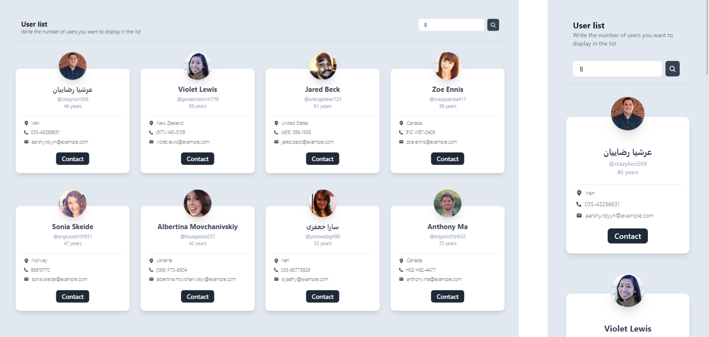

#  Random Users

## Descripción del Proyecto

👩🏽‍💻 **S.XXI Technology** es un proyecto responsive realizado para un reto técnico utilizando como tecnología a Next JS, Tailwind y Typescript. Consiste en un búscador aleatorio de usuarios según la cantidad que coloques.


<div align="center">

</div>


## Empezando
Este es un proyecto [Next.js](https://nextjs.org/) arrancado con [`create-next-app`](https://github.com/vercel/next.js/tree/canary/packages/create-next-app).

## Empezando

Primero, ejecuta el servidor de desarrollo:

```bash
npm run dev
# or
yarn dev
# or
pnpm dev
```

Abre [http://localhost:3000](http://localhost:3000) con tu navegador para ver el resultado.

Puedes empezar a editar la página modificando `src/pages/index.page.tsx`. La página se auto-actualiza a medida que editas el archivo.

## Más información

Para saber más sobre Next.js, echa un vistazo a los siguientes recursos:

- [Documentación de Next.js](https://nextjs.org/docs) - conoce las características y la API de Next.js.
- [Learn Next.js](https://nextjs.org/learn) - un tutorial interactivo de Next.js.

Puedes consultar [el repositorio GitHub de Next.js](https://github.com/vercel/next.js/) - ¡tus comentarios y contribuciones son bienvenidos!